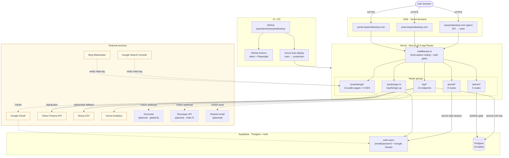
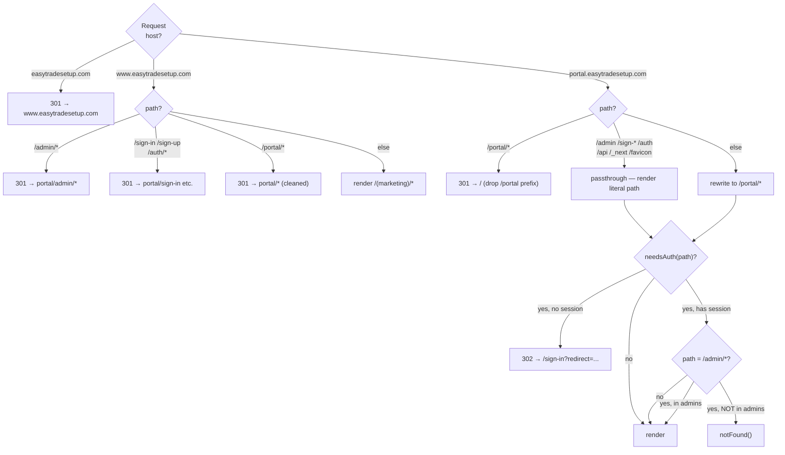
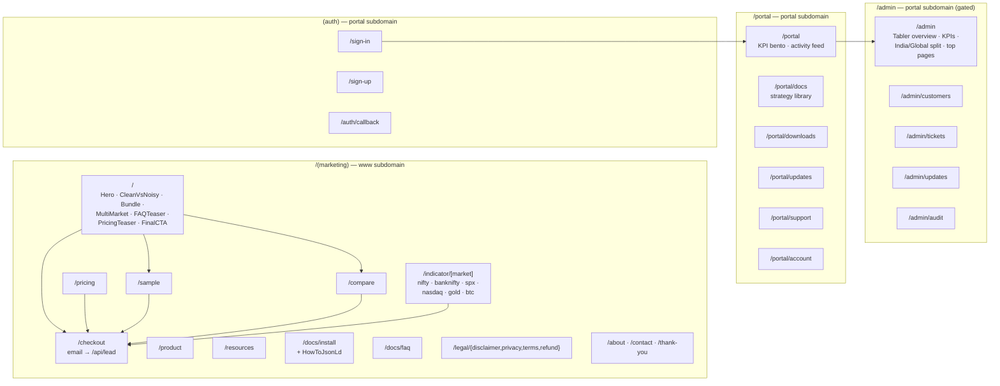
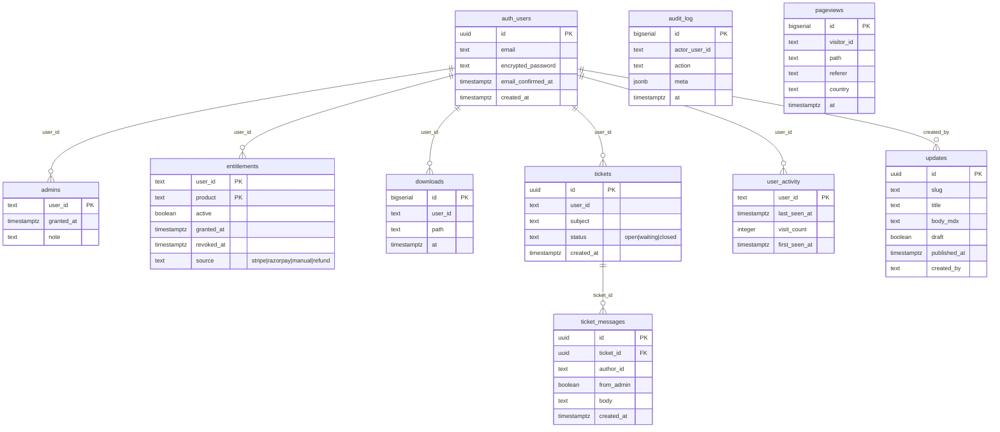
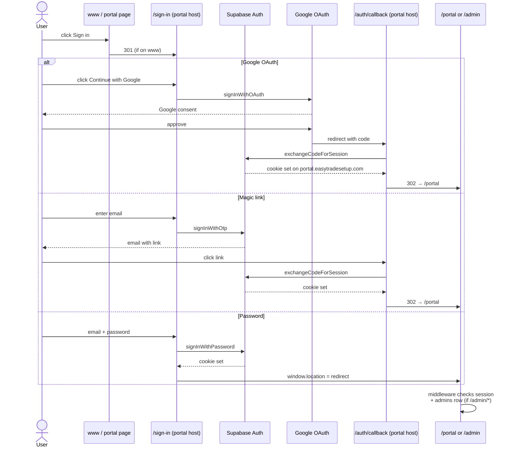
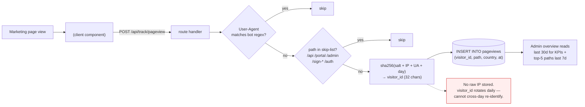
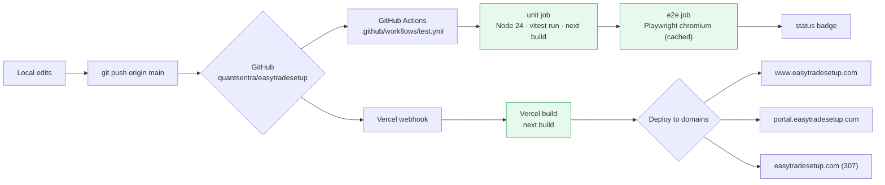

# EasyTradeSetup — System Architecture

State of 2026-04-26. Covers hosting, routing, frontend, backend, database, auth, integrations, CI/CD.

> **Render the diagrams**
>
> - **GitHub** — view this file directly; mermaid blocks render as SVG.
> - **VSCode** — install `Markdown Preview Mermaid Support` extension.
> - **Export PNG/SVG** — paste any mermaid block into <https://mermaid.live> → Actions → Download.
> - **Visio** — draw.io / Lucidchart import mermaid as native diagrams.

---

## 1. System overview



---

## 2. Host-aware routing (middleware.ts)



---

## 3. Frontend route map



---

## 4. Data model



---

## 5. Authentication flow



---

## 6. Pageview tracking pipeline



---

## 7. CI / CD pipeline



---

## 8. Component inventory

| Layer | Module | Purpose |
|---|---|---|
| Marketing chrome | `components/nav/TopNav.tsx` | Top nav + `BrandMark` (cyan-blue gradient logo) |
| | `components/nav/Footer.tsx` | Site footer |
| | `components/nav/SiteDisclaimer.tsx` | Educational + SEBI strip |
| | `components/ui/OfferBanner.tsx` | Dismissible top banner |
| | `components/ui/StickyBuyBar.tsx` | Mobile sticky buy CTA |
| | `components/ui/ExitIntent.tsx` | Exit-intent modal |
| | `components/ui/BackToTop.tsx` | Floating arrow |
| Hero | `components/sections/Hero.tsx` | Main hero with rotating word |
| | `components/ui/HeroSlider.tsx` | 3-screen NIFTY/Gold/US30 ticker |
| Sections | `Bundle`, `MultiMarket`, `CleanVsNoisy`, `FAQTeaser`, `PricingTeaser`, `FinalCTA` | Home composition |
| Auth | `components/auth/SignInForm.tsx` | Google OAuth + magic link + password |
| | `components/auth/AccountMenu.tsx` | Avatar dropdown |
| Portal | `app/portal/layout.tsx` | tz-header + tz-sidenav + tz-footer |
| | `components/nav/PortalMobileNav.tsx` | Hamburger drawer |
| Admin | `app/admin/layout.tsx` | Same shell as portal, isAdmin gate |
| Analytics | `components/analytics/PageviewTracker.tsx` | Fires on every pathname change |
| SEO | `components/seo/JsonLd.tsx` | Organization, WebSite, Product, SoftwareApplication, SiteNavigation, HowTo, FAQ, Breadcrumb |
| Server libs | `lib/admin.ts`, `lib/auth-server.ts`, `lib/supabase/{browser,server}.ts` | Supabase clients + role helpers |
| Constants | `lib/pricing.ts`, `lib/launch.ts` | Single source of truth for prices + offer dates |

---

## 9. Health snapshot

| Area | Status | Note |
|---|---|---|
| Marketing site | ✅ | 7-section home, 6 SEO pages, JsonLd, sitemap, robots, GSC + Bing verified |
| Portal | ✅ | Brand-aligned, sidebar, KPIs, market-notes feed |
| Admin | ✅ | Tabler-style overview, India/Global split, traffic KPIs |
| Auth | ✅ | OAuth + magic link + password (single-host, no double sign-in) |
| Database | ⚠️ | `pageviews` migration pending — run SQL in Supabase |
| Tests | ✅ | 34 unit + 38 e2e green; CI workflow committed |
| Payments | ❌ | Not live. UPI (India) + Gumroad (global) planned |
| Analytics | ⚠️ | Self-hosted pageviews coded; needs migration. Vercel Analytics also wired |
| Email delivery | ❌ | `/api/lead` logs to console; not wired to Resend/Sheet |
| Cron jobs | ❌ | Removed (Hobby plan limits) |

---

## 10. Improvement backlog

### P0 — unblocks revenue
1. Run `005_pageviews.sql` migration in Supabase
2. Wire payments — Razorpay UPI (India) + Gumroad webhook (global)
3. `/api/lead` → Resend send + Supabase `leads` table

### P1 — marketing motion
4. Activate GitHub Actions CI (open PR to trigger first run)
5. Quote API resilience — Twelve Data fallback or Cloudflare Worker proxy
6. Real founder bio + photo + LinkedIn on `/about`
7. First customer testimonials on `/principles` (post-launch only)
8. OG image verification on Twitter/LinkedIn/WhatsApp

### P2 — SEO compounding
9. `/setup/[name] × /market/[m]` programmatic grid (24 pages)
10. `/notes/[slug]` public-facing market notes (gated full body in `/portal/updates`)
11. Internal link graph between `/indicator/*` and setup pages
12. `next/image` AVIF + responsive sizes for all chart screenshots

### P3 — admin polish
13. Sparklines for visitors + revenue (SVG, no chart lib)
14. CSV export on `/admin/customers`
15. Cohort retention — entitlements × pageviews
16. Tickets SLA badge (>24h waiting)
17. Country breakdown (pageviews already capture `country`)

### P4 — durability
18. Verify Supabase backup retention
19. Sentry error reporting (free tier)
20. Rate limit `/api/track/pageview` (lib already exists)
21. Pageview retention prune job (>90d)
22. Vercel BotID on `/checkout`

### P5 — scale prep
23. Vercel Hobby → Pro for crons + longer timeouts
24. Multi-admin via `admins` table inserts
25. `Trade Logic PDF` standalone $9 SKU

---

## 11. Repository layout

```
easytradesetup/
├─ landing-page/
│  ├─ app/                    Next.js App Router routes
│  ├─ components/             UI components (sections, nav, ui, auth, analytics, seo)
│  ├─ lib/                    server helpers + constants
│  ├─ supabase/migrations/    SQL migrations 001-005
│  ├─ public/                 static assets
│  ├─ tests/                  unit (vitest) + e2e (Playwright)
│  ├─ docs/                   ← this file lives here
│  ├─ middleware.ts           host-aware routing + auth gate
│  ├─ tailwind.config.ts      brand tokens (navy + cyan-blue + gold)
│  ├─ next.config.mjs
│  └─ vercel.json
├─ src/pine/                  Golden Indicator Pine v5 source
├─ .github/workflows/test.yml CI workflow
└─ CLAUDE.md                  project context for AI assistant
```
